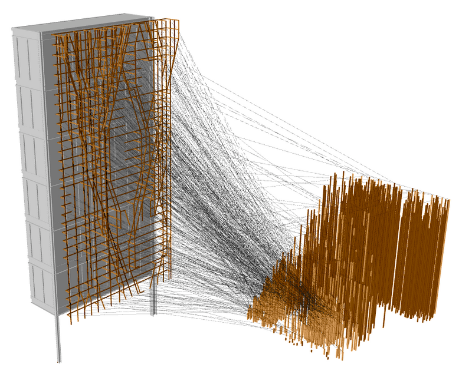
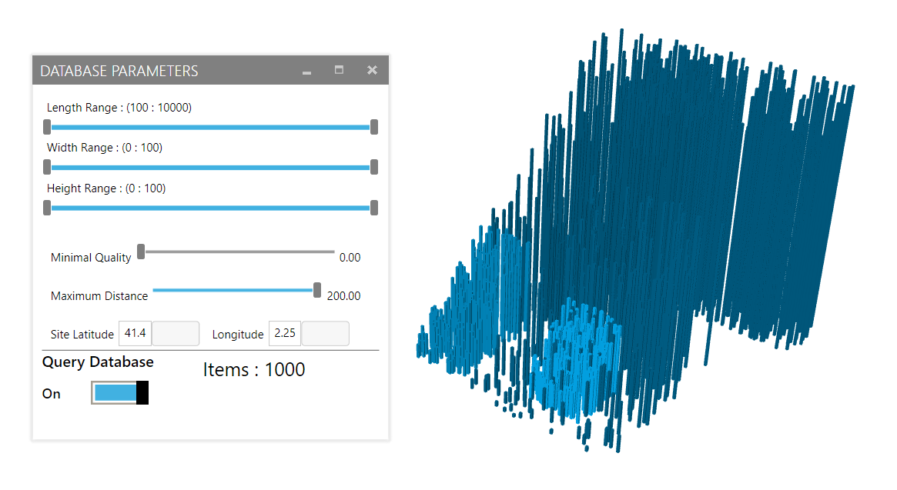
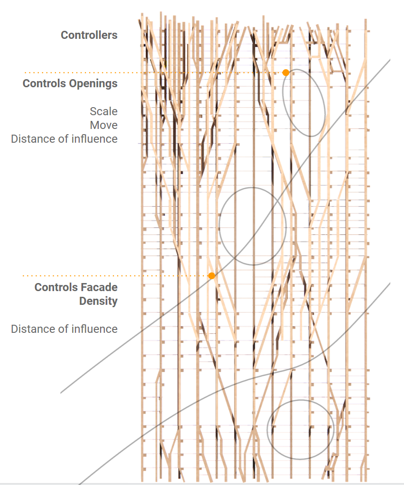

Reusing and Automating Waste
============================
Towards a Circular Building Environment
---------------------------------------

A set of analysis and design tools to reuse of post-demolition materials at practical scales.  
This repo details a prototype example of this process, using reclaimed wooden beams and battens facade designs.

[Project Overview](http://www.iaacblog.com/programs/localize-collate-design-towards-circular-building-environment/)  

Project Structure
----------
- Design context file : Rhino file containing input design constraints and direction. Testing was done with a section of the Plug-In building in Barcelona. 
- design_tool.gh : Complete workflow for developing a design concept for use with a particular materials database. Design generation is tailored for the Plug-In building example, and may be switched out for other uses. 
- /database 
    - database_editing.gh : Utility for generating simulated datasets for testing
    - material_database.s3db : Local SQL database for materials
    - wood_data.csv : Contains structural information for various commonly used wood species. 

Installation
-------
The following Grasshopper plugins are necessary for the design tool:   
- LunchBox  
- ProvingGround Slingshot  
- HumanUI  
- Fologram
- karambaGH    
- Meshedit2000  
- WeaverBird
- ShortestWalk
- Telepathy  

Use
---

Firstly a selection from the dataset is made using the interface window. The user can choose the range for different dimensions of the pieces, as well as the maximum distance to transport the material and quality limits. 

  

The facade shape is built from user supplied curves and areas that determine visual density. These positions are set by the user with a certain range of variability each. The system uses Galapagos to make slight adjustments to these shapes to find a design that can be ideally built with the available materials, as well as maintaining structural viability, and considering transport costs. 

Related Projects
--------
- [Drone Control and Geometry Reconstruction for Site Scanning](https://github.com/MRAC-IAAC/DIGITALIZING-MATERIAL-COLLATION-FROM-PRE-DEMOLITION-SITES)
- [Material Localization in Scanned Imagery](https://github.com/MRAC-IAAC/material_localization)
- [Design Interface Experiments](https://github.com/MRAC-IAAC/fluxsight)
